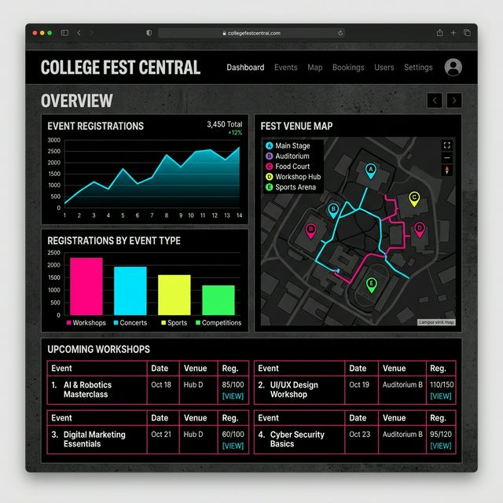
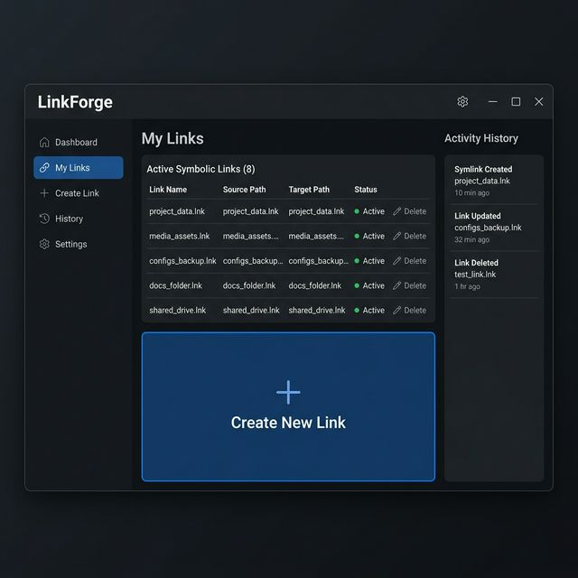
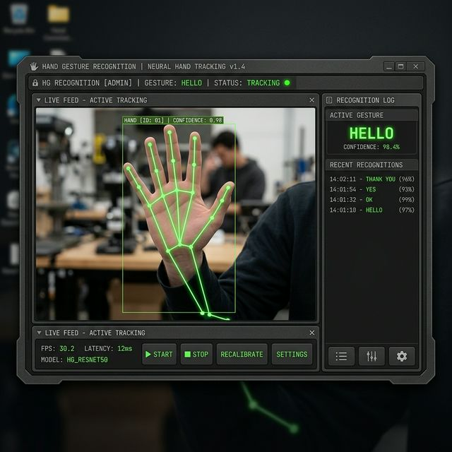

# Work & Projects

Selected projects that showcase my experience in AI, Machine Learning, and Full-Stack Development.

---

  <a href="#project-focus.md" class="project-card">
    
    <h3>College Fest Central (CFC)</h3>
    
A comprehensive platform for event creation, registration, and analytics. Features a built-in recommendation engine and organizer dashboards.

    React • TypeScript • TailwindCSS
  </a>

  <a href="https://github.com/Mathew005/LinkForge" target="_blank" class="project-card">
    
    <h3>LinkForge</h3>
    
A cross-platform desktop utility for managing Symbolic Links and Junctions with history tracking and admin awareness.

    Python • CustomTkinter
  </a>

  <a href="https://github.com/Mathew005/Hand-Gesture-Recognition-ASL" target="_blank" class="project-card">
    
    <h3>Hand Gesture Recognition</h3>
    
Real-time ASL gesture identification system utilizing hand landmark tracking and deep learning models.

    Python • TensorFlow • MediaPipe • OpenCV
  </a>

  <a href="https://github.com/Mathew005" target="_blank" class="project-card">
    <h3>Smart Document Analyzer</h3>
    
AI-powered pipeline with role-based access, processing analytics, and keyword-template parsing for efficient OCR.

    Python • AWS Textract • LangChain
  </a>

---

> [!TIP]
> Check out my [GitHub Profile](https://github.com/Mathew005) for more tools, experiments, and open-source contributions.
